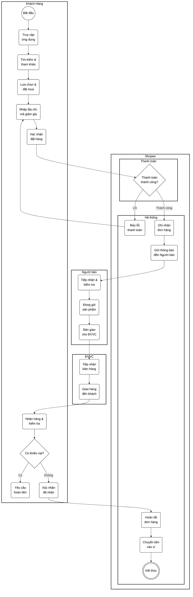
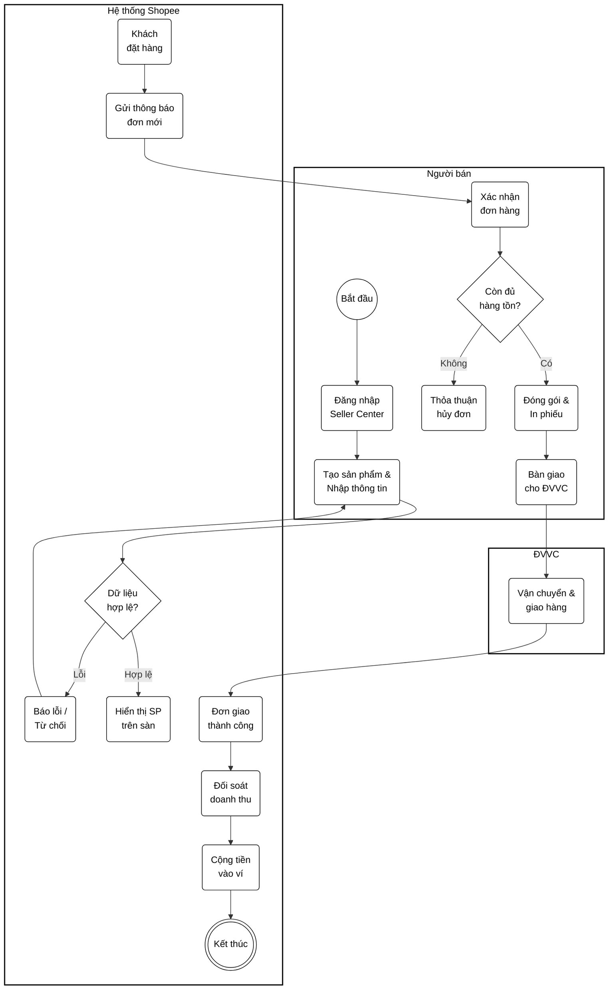
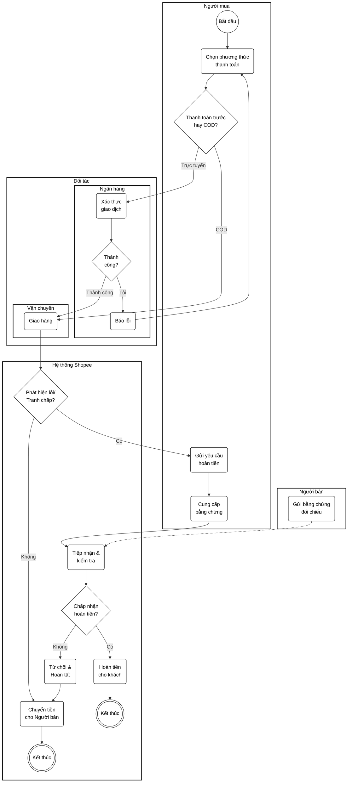
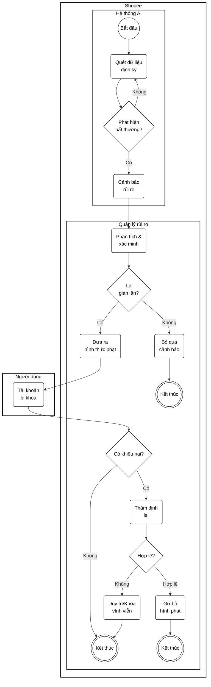
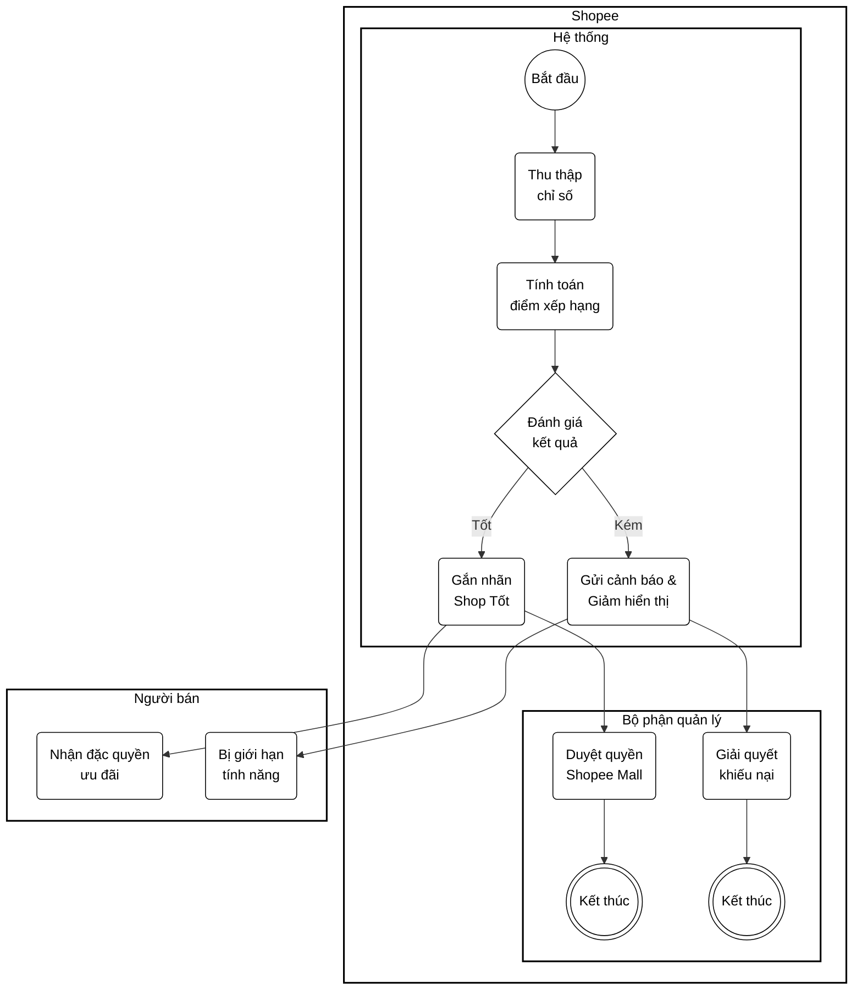
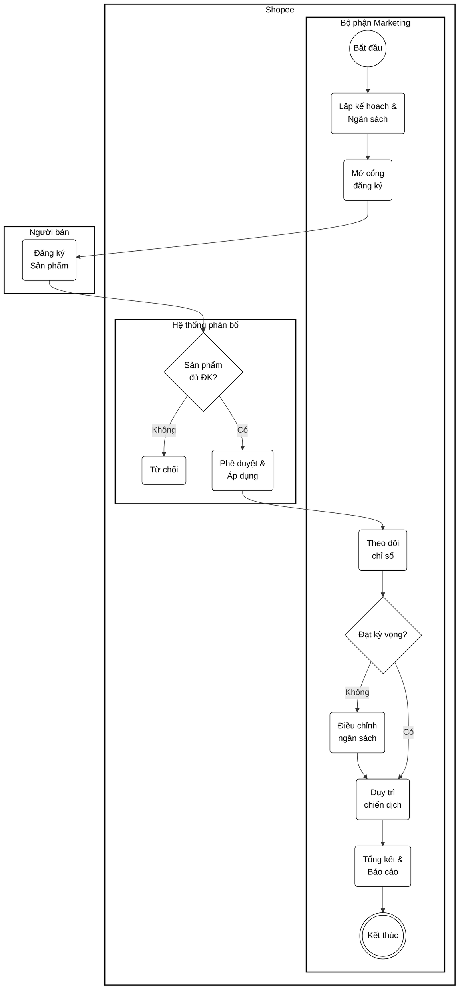
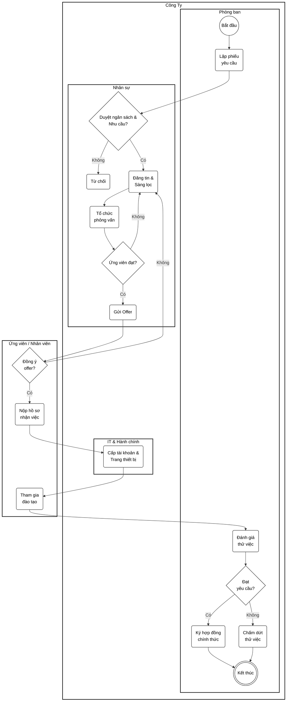
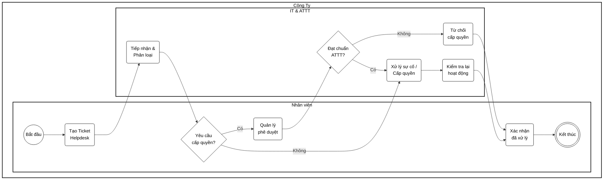
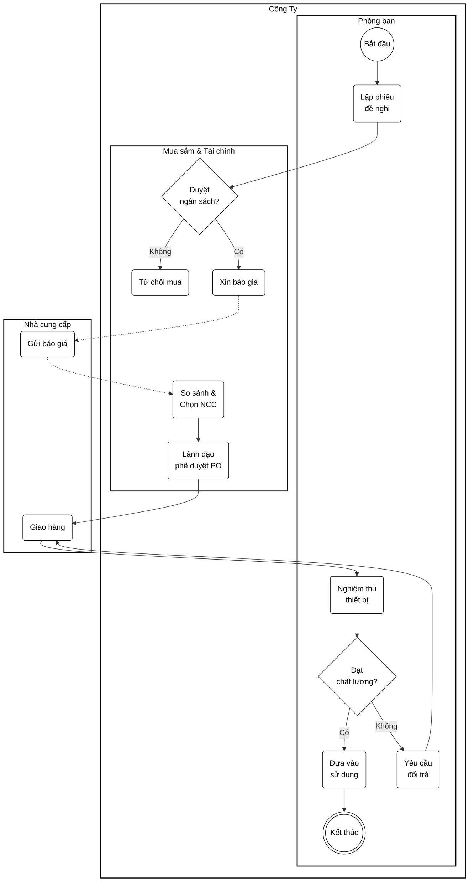
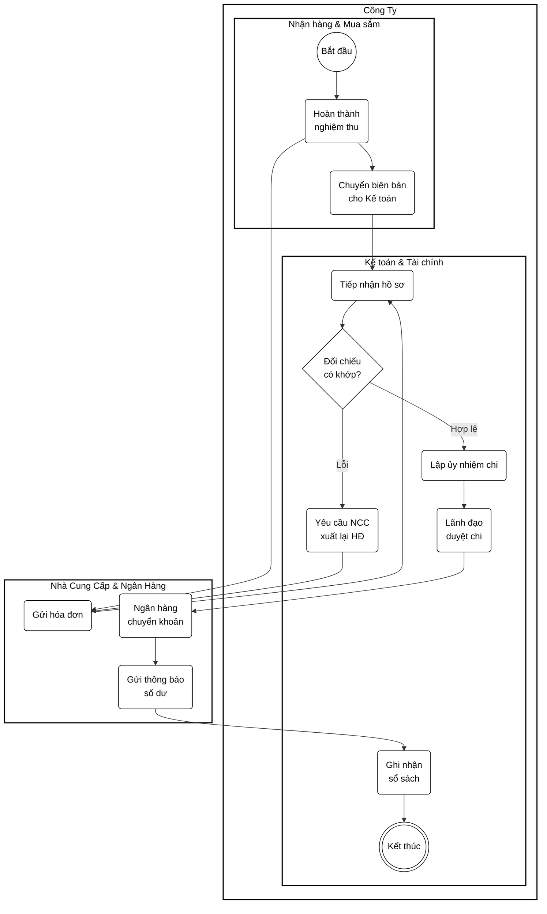

# TÀI LIỆU 10 QUY TRÌNH NGHIỆP VỤ HOÀN CHỈNH

Tài liệu này bao gồm mô tả chi tiết, phân tích kịch bản (Cases) và lưu đồ (BPMN Code) tối ưu dọc (Vertical Swimlane) cho 10 quy trình, phân nhóm chuẩn.

## 1. QUY TRÌNH CỐT LÕI

### 1.1 Quy trình đặt và giao hàng
**Actor (Tác nhân):** Người mua (Khách hàng), Người bán (Shop), Hệ thống Shopee, Đơn vị vận chuyển, Hệ thống thanh toán

**Phân tích các kịch bản (Cases):**
- Happy Case (Luồng lý tưởng): Khách hàng tìm thấy sản phẩm, đặt hàng với thông tin hợp lệ, thanh toán thành công. Người bán đóng gói và giao đúng hạn. Khách nhận hàng không có khiếu nại, tiền được chuyển cho người bán.
- Unhappy Case (Luồng thất bại): Khách hàng từ chối nhận hàng. Người bán không chuẩn bị hàng kịp. Giao hàng thất bại nhiều lần dẫn đến hoàn trả.
- Validation (Ràng buộc dữ liệu): Số lượng mua <= Tồn kho. Mã giảm giá hợp lệ. Thông tin giao hàng không để trống.
- Edge Case (Luồng ngoại lệ): Khách hủy đơn ngay lúc shipper quét mã lấy hàng. Kiện hàng thất lạc do thiên tai/hỏa hoạn.

**Lưu đồ BPMN (Mermaid Code):**

---

### 1.2 Quy trình người bán đăng bán và xử lý đơn hàng
**Actor (Tác nhân):** Người bán, Hệ thống Shopee, Người mua, Đơn vị vận chuyển

**Phân tích các kịch bản (Cases):**
- Happy Case: Người bán tạo sản phẩm hợp lệ, được duyệt. Đóng gói đúng hạn, giao shipper thành công, nhận tiền.
- Unhappy Case: Sản phẩm bị từ chối do vi phạm. Người bán gửi nhầm hàng dẫn đến trả hàng. Shipper không đến lấy.
- Validation: Trọng lượng/kích thước trong giới hạn cho phép. Giá > 0.
- Edge Case: Nhấn "Chuẩn bị hàng" nhưng phát hiện kho trống, phải thỏa thuận khách hủy đơn.

**Lưu đồ BPMN (Mermaid Code):**

---

### 1.3 Quy trình thanh toán và hoàn tiền
**Actor (Tác nhân):** Người mua, Người bán, Hệ thống Shopee, Cổng thanh toán, Ngân hàng hoặc ví điện tử, Đơn vị vận chuyển

**Phân tích các kịch bản (Cases):**
- Happy Case: Thanh toán online/COD thành công. Khách nhận hàng ưng ý hoặc hoàn tiền thành công khi có lỗi hợp lệ.
- Unhappy Case: Thẻ bị từ chối. Tranh chấp bị từ chối do người bán có bằng chứng đúng.
- Validation: Hạn mức thẻ >= Tổng đơn. Yêu cầu hoàn tiền trong thời gian quy định.
- Edge Case: Tranh chấp phức tạp, Shopee phải đền bù cho cả 2 bên.

**Lưu đồ BPMN (Mermaid Code):**

---

## 2. QUY TRÌNH QUẢN LÝ

### 2.1 QUY TRÌNH QUẢN LÝ KIỂM SOÁT BẢO MẬT/GIAN LẬN
**Actor (Tác nhân):** Bộ phận Quản lý rủi ro và gian lận, Hệ thống AI, Người mua/Người bán, Quản trị Shopee

**Phân tích các kịch bản (Cases):**
- Happy Case: Hệ thống AI quét trúng tài khoản lừa đảo. Bộ phận xác minh, khóa vĩnh viễn và bảo vệ nền tảng.
- Unhappy Case: AI nhận diện nhầm sinh viên chung wifi là tạo đơn ảo (False Positive). Bị khiếu nại ồ ạt.
- Validation: Risk Score > X. Device IP không trùng lặp đáng ngờ.
- Edge Case: Hacker dùng giả mạo IP cực tinh vi lọt qua bộ lọc, gây thất thoát mã giảm giá.

**Lưu đồ BPMN (Mermaid Code):**

---

### 2.2 QUY TRÌNH QUẢN LÝ HIỆU SUẤT VÀ CHẤT LƯỢNG NGƯỜI BÁN
**Actor (Tác nhân):** Bộ phận quản lý đối tác/người bán, Người bán, Người mua, Hệ thống

**Phân tích các kịch bản (Cases):**
- Happy Case: Shop làm tốt được tăng hiển thị (Shopee Mall). Shop kém bị giảm hiển thị tự động.
- Unhappy Case: Thiên tai diện rộng làm nhiều shop không giao được hàng, hệ thống tự động trừ điểm nhầm.
- Validation: Tỷ lệ hủy đơn phải <= 10%. Điểm đánh giá (0-5 sao).
- Edge Case: Đối thủ tạo clone boom hàng để shop bị rớt hạng sao oan uổng.

**Lưu đồ BPMN (Mermaid Code):**

---

### 2.3 QUY TRÌNH QUẢN LÝ VÀ ĐIỀU PHỐI CHIẾN DỊCH MARKTETING
**Actor (Tác nhân):** Bộ phận Marketing và quản lý chiến dịch, Bộ phận phân tích dữ liệu, Người bán, Hệ thống phân bổ voucher

**Phân tích các kịch bản (Cases):**
- Happy Case: Mã giảm giá tung ra, hệ thống chịu tải tốt, doanh thu đạt chỉ tiêu, báo cáo đẹp.
- Unhappy Case: Lượng truy cập vượt mức gây sập server. Người dùng không áp được mã, đánh giá app 1 sao.
- Validation: Ngân sách chiến dịch <= Ngân sách duyệt. Thời gian không chồng chéo phi logic.
- Edge Case: Setup nhầm giảm 50K thành giảm 500K không giới hạn, gây thiệt hại tài chính nghiêm trọng trước khi phát hiện.

**Lưu đồ BPMN (Mermaid Code):**

---

## 3. QUY TRÌNH HỖ TRỢ

### 3.1 Quy trình tuyển dụng và tiếp nhận nhân viên mới
**Actor (Tác nhân):** Phòng ban có nhu cầu, Trưởng bộ phận, Bộ phận Nhân sự, Ứng viên, Bộ phận IT, Hành chính, Nhân viên mới

**Phân tích các kịch bản (Cases):**
- Happy Case: Tìm được ứng viên giỏi, nhận việc đúng hạn. IT cấp quyền đầy đủ, thử việc thành công.
- Unhappy Case: Không tìm được ai phải đăng lại. Ứng viên đậu nhưng từ chối offer. Thử việc không đạt.
- Validation: Ngân sách lương <= Ngân sách năm của phòng ban. Hồ sơ nhân sự phải đầy đủ bằng cấp.
- Edge Case: Ứng viên nhận việc 1 ngày xong biến mất không báo trước, công ty đã sắm thiết bị và cấp quyền.

**Lưu đồ BPMN (Mermaid Code):**

---

### 3.2 Quy trình hỗ trợ kỹ thuật và cấp quyền hệ thống nội bộ
**Actor (Tác nhân):** Nhân viên Shopee, Quản lý trực tiếp, IT Helpdesk, Quản trị viên hệ thống, An toàn thông tin

**Phân tích các kịch bản (Cases):**
- Happy Case: Nhân viên báo lỗi máy tính, IT tiếp nhận và sửa trong 30p, ticket đóng lại thành công.
- Unhappy Case: Sự cố phần cứng nặng phải chuyển bảo hành. Xin quyền bị ATTT từ chối do trái quy định.
- Validation: Quyền được xin phải khớp với chức danh. Ticket phải có ảnh đính kèm mô tả lỗi.
- Edge Case: Máy chủ bị ransomware tấn công diện rộng, hàng loạt ticket IT mở cùng lúc làm sập hệ thống Helpdesk.

**Lưu đồ BPMN (Mermaid Code):**

---

### 3.3 Quy trình mua sắm thiết bị và dịch vụ phục vụ hoạt động
**Actor (Tác nhân):** Phòng ban đề xuất, Trưởng bộ phận, Bộ phận Mua sắm, Bộ phận Tài chính, Ban lãnh đạo, Nhà cung cấp, Hành chính

**Phân tích các kịch bản (Cases):**
- Happy Case: Tìm được NCC rẻ, hàng chuẩn, giao đúng hạn. Nghiệm thu suôn sẻ, bàn giao đủ.
- Unhappy Case: Hết ngân sách. NCC giao trễ hẹn. Hàng lỗi phải yêu cầu đổi trả.
- Validation: Giá mua <= Ngân sách duyệt. Phải có tối thiểu 3 báo giá cạnh tranh.
- Edge Case: NCC phá sản ngay sau khi nhận tiền cọc, công ty phải truy thu pháp lý.

**Lưu đồ BPMN (Mermaid Code):**

---

### 3.4 Quy trình đối soát và thanh toán cho nhà cung cấp
**Actor (Tác nhân):** Nhà cung cấp, Mua sắm, Bộ phận sử dụng, Hành chính, Kế toán, Tài chính, Ngân hàng

**Phân tích các kịch bản (Cases):**
- Happy Case: Hồ sơ khớp 100%, sếp duyệt nhanh, ngân hàng chuyển tiền trong ngày, NCC hài lòng.
- Unhappy Case: Hóa đơn sai thông tin mã số thuế công ty. Ngân hàng lỗi bảo trì làm chậm giao dịch.
- Validation: Số tiền hóa đơn = Số tiền nghiệm thu. Hóa đơn phải hợp lệ (e-invoice).
- Edge Case: Bị hacker đánh tráo email hóa đơn của NCC sang tài khoản lừa đảo, kế toán chuyển nhầm tiền tỷ.

**Lưu đồ BPMN (Mermaid Code):**

---

