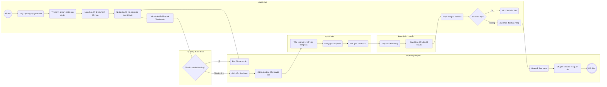
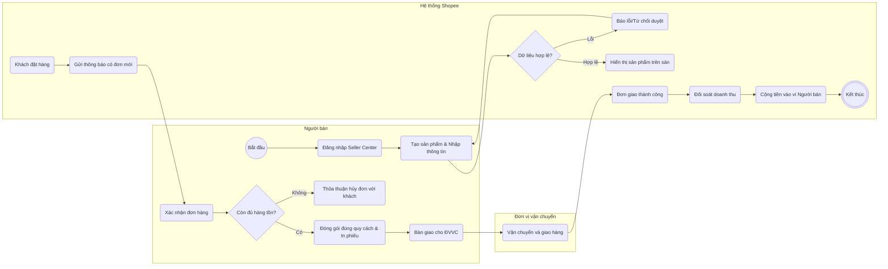
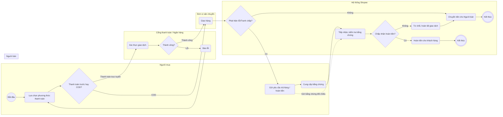
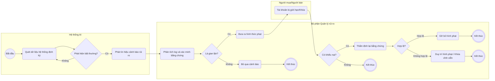
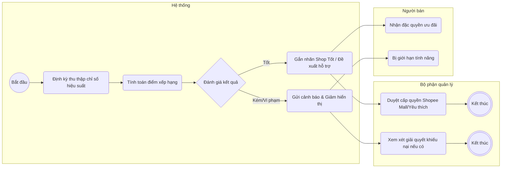
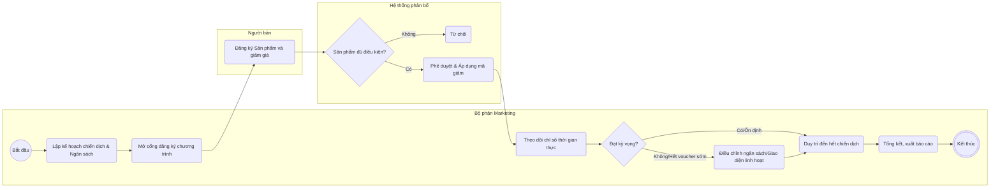
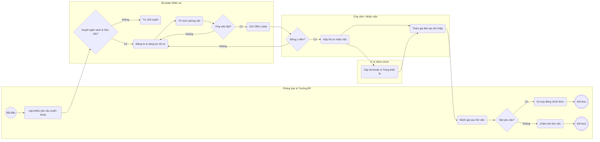
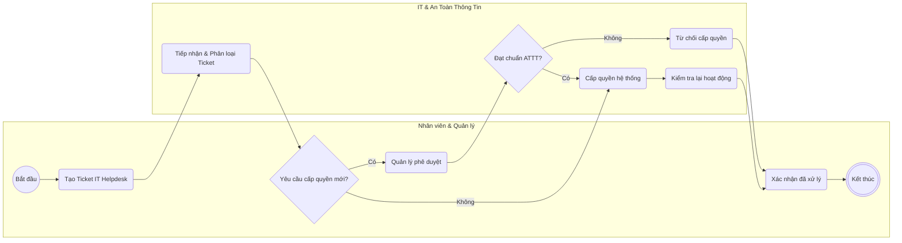
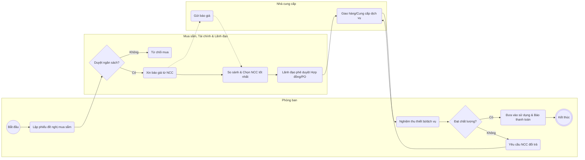
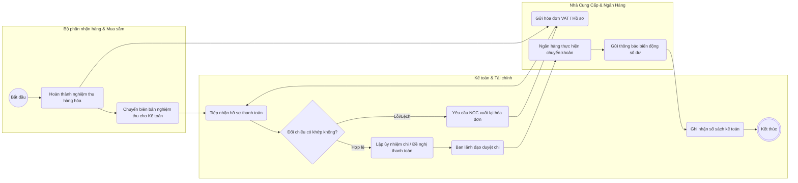

# CODE MERMAID (MÔ PHỎNG BPMN 2.0 CHUẨN KÝ HIỆU) CHO 10 QUY TRÌNH

Mã nguồn đã được rà soát và chỉnh sửa chuẩn xác từng ký hiệu theo chuẩn BPMN 2.0:
- **Start Event (Bắt đầu)**: Ký hiệu hình tròn nét đơn `(( ))`.
- **End Event (Kết thúc)**: Ký hiệu hình tròn nét đôi `((( )))`.
- **Task (Hoạt động/Nhiệm vụ)**: Ký hiệu hình chữ nhật bo góc `( )`.
- **Gateway (Cổng rẽ nhánh)**: Ký hiệu hình thoi `{ }`.

---

## 1. QUY TRÌNH CỐT LÕI

### 1.1 Quy trình đặt và giao hàng

### 1.2 Quy trình người bán đăng bán và xử lý đơn hàng

### 1.3 Quy trình thanh toán và hoàn tiền

---

## 2. QUY TRÌNH QUẢN LÝ

### 2.1 QUY TRÌNH QUẢN LÝ KIỂM SOÁT BẢO MẬT/GIAN LẬN (QT1)

### 2.2 QUY TRÌNH QUẢN LÝ HIỆU SUẤT VÀ CHẤT LƯỢNG NGƯỜI BÁN (QT2)

### 2.3 QUY TRÌNH QUẢN LÝ VÀ ĐIỀU PHỐI CHIẾN DỊCH MARKETING (QT3)

---

## 3. QUY TRÌNH HỖ TRỢ

### 3.1 Quy trình tuyển dụng và tiếp nhận nhân viên mới

### 3.2 Quy trình hỗ trợ kỹ thuật và cấp quyền hệ thống nội bộ

### 3.3 Quy trình mua sắm thiết bị và dịch vụ phục vụ hoạt động

### 3.4 Quy trình đối soát và thanh toán cho nhà cung cấp

